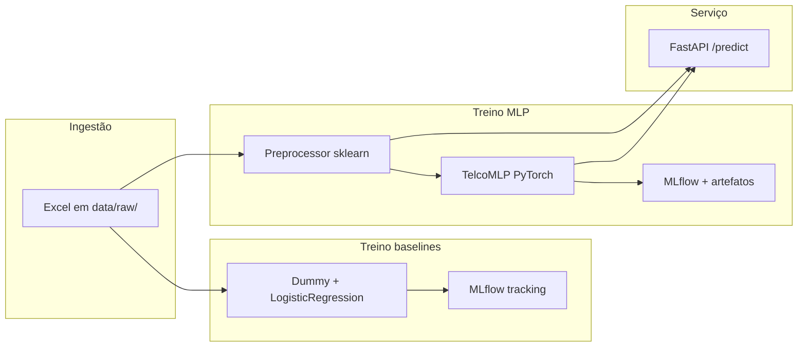

# Tech Challenge Fase 1 — Churn Telco (ML)

Repositório do **Tech Challenge Fase 01** (trilha de Machine Learning): classificação binária de **churn** em clientes de telecomunicações, com **EDA**, **baselines** (scikit-learn), **modelo neural (MLP PyTorch)**, **MLflow**, **API FastAPI** para inferência e testes automatizados.

---

## Vídeo de Apresentação (Método STAR)

Confira a apresentação completa do projeto no link abaixo:
[Assista ao vídeo do Tech Challenge - Fase 1](https://drive.google.com/file/d/1UxlMiqDbnViKHTvyutl5TTxELeIJs0XW/view?usp=sharing)

---

## O problema

- **Tarefa:** prever se o cliente **cancela** o serviço (`target = 1`) ou **permanece** (`target = 0`).
- **Dados:** cinco planilhas Excel em `data/raw/` (demografia, localização, serviços, população por CEP, status/satisfação/churn), unificadas por `CustomerID` / `ZipCode` em `src/data/loaders.py`. Colunas de vazamento (rótulo direto, score de churn, etc.) são removidas antes do treino — `LEAKAGE_COLUMNS` em `src/config.py`.
- **Uso pretendido:** priorizar clientes para **retenção**, o projeto enfatiza **PR-AUC** e métricas complementares — [`docs/decisao_metricas_etapa_1.md`](docs/decisao_metricas_etapa_1.md).

---

## Visão da solução

Fluxo de ponta a ponta:



- **Baselines:** pipeline com pré-processamento + modelo; validação cruzada no treino e holdout para métricas; runs no MLflow.
- **MLP:** dados já tabulares em `data/processed/telco_churn_model_ready.csv` (versão “model-ready” gerada na EDA); `train_mlp` ajusta o preprocessor, treina com early stopping, salva `models/mlp_model.pth` e `models/preprocessor_pipeline.pkl`, registra métricas e modelo no MLflow.
- **API:** na subida, carrega preprocessor + pesos da MLP e expõe `POST /predict` com o contrato Pydantic alinhado às colunas de entrada.

Documentação de produto/ML Canvas: [`docs/ml_canvas.md`](docs/ml_canvas.md).

---

## Pré-requisitos

- **Python 3.13+** (conforme `pyproject.toml`)
- **Git**
- **Make** (Windows: `winget install GnuWin32.Make` ou Chocolatey)

---

## Setup e instalação

### Clonar o projeto
```bash
git clone https://github.com/crisleymarques/postech-ml-challenge-fase-1.git
cd postech-ml-challenge-fase-1
```
### Criar e ativar o ambiente virtual
```bash
python3 -m venv .venv
# Linux / macOS:
source .venv/bin/activate
# Windows (Git Bash):
source .venv/Scripts/activate
# Windows (PowerShell):
# .\.venv\Scripts\Activate.ps1
```
### Instalação das Dependências
```bash
make install
```

**Dados:** os arquivos Excel esperados já estão versionados em `data/raw/`. O CSV processado `data/processed/telco_churn_model_ready.csv` e o manifesto JSON acompanham o repositório para treino da MLP e testes sem rerodar notebooks. Para **regerar** o processado a partir de novas regras, use o notebook [`notebooks/01_eda_telco_churn.ipynb`](notebooks/01_eda_telco_churn.ipynb) (mantém alinhamento com o manifesto).


---

## Treino e inferência

### Baselines

Treina `dummy_classifier` e `logistic_regression`, registra métricas e artefatos no MLflow.

```bash
make train-baselines
# ou:
python -m src.train_baselines --model all
python -m src.train_baselines --model logistic_regression
```

### MLP PyTorch

```bash
make train-mlp
# ou:
python -m src.train_mlp --epochs 100 --patience 10 --batch-size 32 --hidden-dim 64 --lr 0.001
```

Saídas principais:

- `models/mlp_model.pth` — pesos da rede
- `models/preprocessor_pipeline.pkl` — pipeline de pré-processamento usado na API

**Inferência em batch:** use o modelo logado no MLflow ou carregue os artefatos como em `src/main.py`. **Inferência online:** suba a API (seção seguinte) e chame `POST /predict`.

### MLflow UI

O tracking URI padrão é SQLite em `mlflow.db` na raiz (`MLFLOW_TRACKING_URI` em `src/config.py`). Para ver runs:

```bash
make mlflow-ui
```

Acessar `http://127.0.0.1:5000`

---

## Execução da API

Requer `models/preprocessor_pipeline.pkl` e `models/mlp_model.pth` (gerados pelo `train_mlp` ou já versionados).

```bash
# com venv ativa, na raiz do repositório:
uvicorn src.main:app --reload --host 0.0.0.0 --port 8000
```

### Endpoints:

| Método | Caminho     | Descrição |
|--------|-------------|-----------|
| GET    | `/health`   | Saúde do serviço |
| POST   | `/predict`  | JSON com todas as chaves do schema `CustomerData` em `src/api/schemas.py` |

#### Acesse

```bash
curl -s http://127.0.0.1:8000/health
```

Documentação interativa: `http://127.0.0.1:8000/docs`

---

## Testes e qualidade

```bash
make test      # pytest em tests/
make lint      # ruff check
make format    # ruff format
make quality   # lint + test
```

Os testes da API (`tests/test_api.py`) carregam a aplicação com `TestClient` e validam `/health`, `/predict` e erro de validação (422).

---

## Estrutura do repositório

```
postech-ml-challenge-fase-1/
├── README.md
├── pyproject.toml                   # dependências e metadados do pacote
├── Makefile                         # install, lint, format, test, train-*, mlflow-ui
├── src/
│   ├── main.py                      # app FastAPI + lifespan (carrega artefatos)
│   ├── config.py                  # caminhos, seeds, MLflow, colunas de vazamento
│   ├── train_baselines.py         # entrypoint baselines + MLflow
│   ├── train_mlp.py               # entrypoint MLP + MLflow
│   ├── api/                       # router, schemas Pydantic
│   ├── data/                      # loaders, manifesto do dataset processado
│   ├── features/                  # preprocessor para tabular
│   ├── models/                    # MLP PyTorch, baselines sklearn
│   ├── training/                  # loop MLP, early stopping
│   ├── evaluation/                # métricas, plots
│   └── tracking/                  # helpers MLflow
├── tests/                           # pytest (dados, métricas, treino smoke, API, …)
├── notebooks/                       # EDA, baselines/métricas, MLP
├── data/
│   ├── raw/                         # Excel Telco (entrada dos baselines)
│   └── processed/                   # CSV model-ready + manifest JSON
├── models/                          # .pth + preprocessor.pkl servindo a API
├── docs/                            # ML Canvas, decisão de métricas, model card, …
└── mlflow.db / mlruns/              # gerados após treinos (sqlite / artefatos locais)
```

---

## Referências rápidas

| Documento | Conteúdo |
|-----------|----------|
| [`docs/ml_canvas.md`](docs/ml_canvas.md) | ML Canvas (tarefa, dados, deploy, monitoramento) |
| [`docs/decisao_metricas_etapa_1.md`](docs/decisao_metricas_etapa_1.md) | Métrica principal (PR-AUC) e complementares |